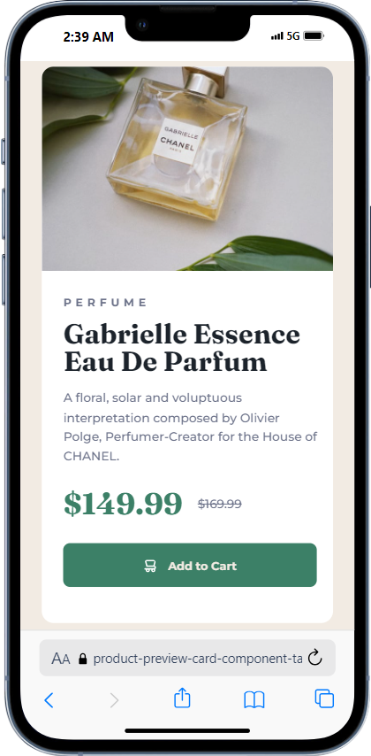

# Frontend Mentor - Product preview card component solution

This is a solution to the [Product preview card component challenge on Frontend Mentor](https://www.frontendmentor.io/challenges/product-preview-card-component-GO7UmttRfa). Frontend Mentor challenges help you improve your coding skills by building realistic projects.

## Table of contents

- [Overview](#overview)
  - [The challenge](#the-challenge)
  - [Screenshot](#screenshot)
  - [Links](#links)
- [My process](#my-process)
  - [Built with](#built-with)
  - [What I learned](#what-i-learned)
  - [Useful resources](#useful-resources)
- [Author](#author)

**Note: Delete this note and update the table of contents based on what sections you keep.**

## Overview

### The challenge

Users should be able to:

- View the optimal layout depending on their device's screen size
- See hover and focus states for interactive elements

### Screenshot



### Links

- Solution URL: [https://github.com/Devdainty/Product-preview-card-component](https://github.com/Devdainty/Product-preview-card-component)
- Live Site URL: [https://product-preview-card-component-tan-zeta.vercel.app/](https://product-preview-card-component-tan-zeta.vercel.app/)

## My process

### Built with

- Semantic HTML5 markup
- CSS custom properties
- CSS Grid
- Mobile-first workflow

**Note: These are just examples. Delete this note and replace the list above with your own choices**

### What I learned

- Scalling through different pictures, either for mobile or desktop.

```html

```

### Useful resources

- [mdn web docs](https://developer.mozilla.org/en-US/docs/Learn/HTML/Multimedia_and_embedding/Responsive_images) - This helped me in responsive images. I really liked this pattern and will use it going forward.

## Author

- Frontend Mentor - [@devdainty](https://www.frontendmentor.io/profile/devdainty)
- Twitter - [@devdainty](https://www.twitter.com/devdainty)
